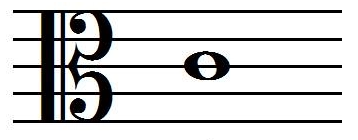

# UT


Simple and fast Unit Test framework.

The goal is to accelerate the Test Driven Development methodology.

It is primarily focused on C/C++, under the form of a single header file,
and is meant to be completely independent to the existing build framework,
using a set a convenience scripts to automate the building and running of the tests.

Some scripts also offer some kind of Python support (using pytest under the hood).

# How to use
Include (quoted) `ut.h` single header inside any C or C++ file and add testcases like this:
```C
// Some "a.c" (or "a.cpp") source file
int foo { return 42; }
...
#include "ut.h"
TESTCASE(Test_foo_behaviour)
    TESTMETHOD(test_foo_returns_the_answer) {
        ASSERT_EQ(42, foo());
    }
...
```
Note that, usually, the tests are preferably put in separate files (usually named `test_*.{c,cpp}` or `*_test.{c,cpp}`, although the `ut` framework actually detects any source including the proper header as above).
In that case, all that is needed, is to include the source file at the top of the test file (remember: this is a unit-test framework), like so:
```C
// Some "test_a.c" (or eg: "a_test.cpp") test file
#include "path/to/a.c"          // or #include "path/to/a.cpp"

#include "ut.h"
TESTCASE(Test_foo_behaviour)
    TESTMETHOD(test_foo_returns_the_answer) {
        ASSERT_EQ(42, foo());
    }
...
```


`TESTCASE` registers a kind of TestCase 'class', like with Python `unittest`/`pytest`
and `TESTMETHOD` registers a test method inside such a TestCase 'class'.
Inside such a test method, regular C/C++ code can be written, using `ASSERT*` provided macros
to perform test assertions.

Note that, for simple tests cases, the `TESTCASE` construct can be ommitted, thus only `TESTMETHOD` have to be used, for less boilerplate code.
This can be useful eg: for quickly prototyping an idea with the following minimalistic source/test file:
```C
// Some "a.c" (or "a.cpp") source source/test file
int foo { return 42; }
...
#include "ut.h"
TESTMETHOD(test_foo_returns_the_answer) {
    ASSERT_EQ(42, foo());
}
...
```
The only caveat, in that case, is that all such defined `TESTMETHOD` symbols (`test_foo_returns_the_answer` in that case) must be unique, whereas they could be duplicates when registered in different `TESTCASE` like previously.


Then the resulting C/C++ test file can be simply built/run as an unit-test executable:
```
$ gcc a.c && ./a.out
```
The executable returns 0 if all test cases/methods pass.

# Convenience tools
Some optional tools are provided, to accelerate the TDD-loop approach: red-green-refactor steps.

1) a `Makefile` is provided to automatically clean/build/test all C/C++ adequate test files
2) a `watch.sh` shell scripts constinuously monitors file-system changes and re-run modified tests
3) an `ut` shell script abstracts these `clean`, `test`, `watch`, ... commands. See `ut --help`
4) `ut` supports Bash auto-completion; register it in `.bashrc` like so: `[ -x ~/ut_/ut ] && . ~/ut_/ut`
(just adapt to where you did install the `ut_` repo on your system)

# Dependencies
It is required to install the following dependencies:
- `make4.3+`, `gcc13.2+`
- `python3.9+`
- `inotify-tools`

It is also recommended to install those too:
- `pytest`
- `tcc`, `clang`
- `valgrind`
